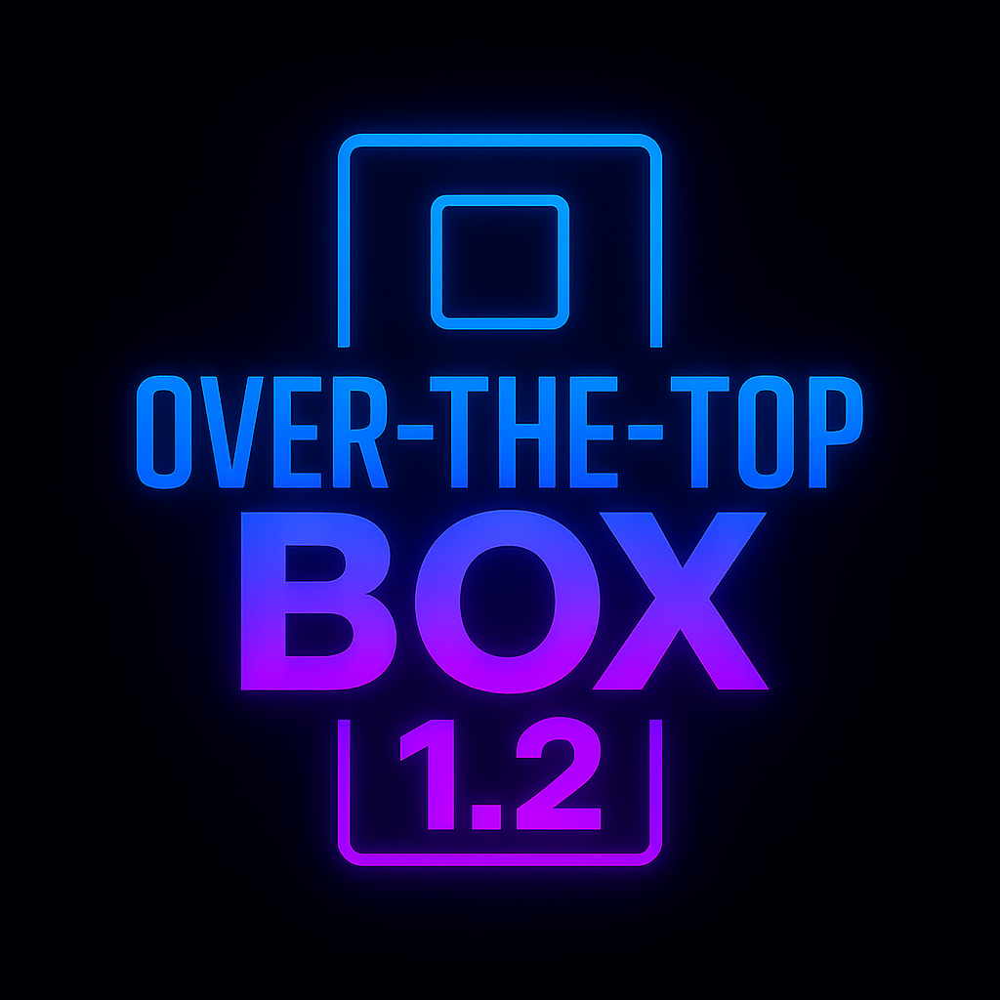
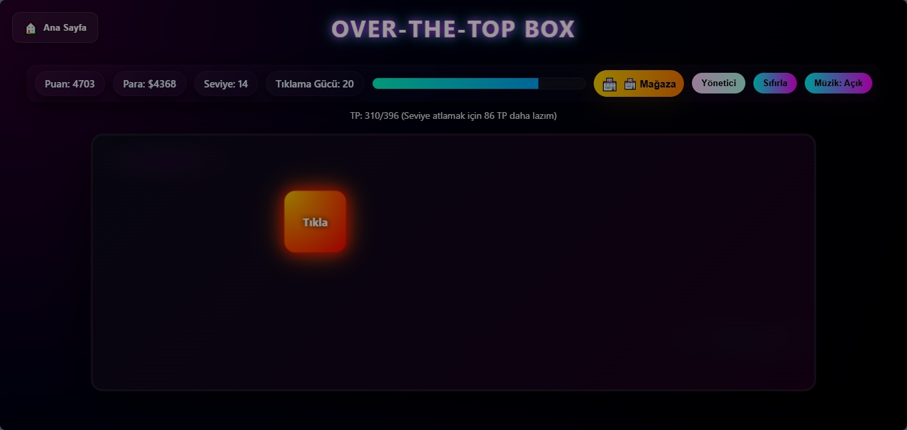
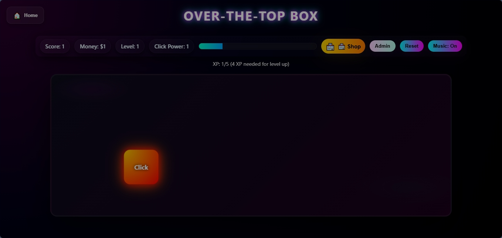

# OVER‑THE‑TOP BOX 🎮

Refleks tabanlı, tek HTML dosyasında çalışan bir tıklama oyunu.  
A reflex‑based click game running in a single HTML file.

---

## 🇹🇷 TÜRKÇE

### 🎮 Oyun Özeti
OVER‑THE‑TOP BOX, her tıklamada rastgele ışınlanan bir butonla refleks odaklı bir tıklama oyunudur.  
Zorluk sistemi, mağaza, otomatik tıklayıcılar, seviye sistemi ve şifre korumalı yönetici paneli içerir.

---

### 📥 Kurulum
- ZIP dosyasını indirin.  
- **OVER-THE-TOP BOX 1.2** klasörünü çıkartın.  
- İçindeki **index.html** dosyasını tarayıcıya sürükleyerek açın.

---

### 🔄 Güncelleme
Yeni sürümü indirmek için:
👉 [OVER-THE-TOP BOX Website](https://spoyraz17.github.io/OVER-THE-TOP-BOX/)  
Eski sürüm klasörünü silin ve bu yeni dosyayı kullanın.

---

### 🚀 1.2 Güncelleme Notları
⚡ Combo Sistemi (Refleks Odaklı)

Oyuncu 1 saniye içinde tekrar tıklarsa Combo başlar.

Combo arttıkça (x2, x3, x4…) kazanılan para ve XP çarpanla artar.

Combo kesilirse çarpan sıfırlanır.

Ekranda yanıp sönen COMBO XN göstergesi eklendi.

Amaç: hızlı refleksi ödüllendirmek ve tempoyu artırmak.

⭐ Şanslı Altın Kutu (Event Sistemi)

Her 50 tıklamada normal kutu yerine 3 saniyelik Altın Kutu çıkar.

Altın Kutuya tıklamak 10x para kazandırır.

Nadir event sistemi ile oyuncunun sürekli ekrana odaklanması sağlandı.

🎨 Dinamik Tema Sistemi (Görsel İlerleme)

Seviye ilerledikçe oyun teması değişir:

Level 0–25 → Standart karanlık tema

Level 26–50 → Neon Mavi / Cyberpunk tema

Level 51–75 → Lav / Cehennem teması

Level 76–100 → Altın / Efsanevi tema

Oyuncunun ilerleme hissini güçlendirmek için görsel geri bildirim eklendi.

---

### 🧩 Özellikler
- Işınlanan tıklama butonu  
- Zorluk sistemi (Kolay / Orta / Zor)  
- Mağaza ve yükseltmeler  
- Otomatik tıklayıcılar  
- Seviye sistemi (Hedef: Level 100)  
- Ses efektleri  
- Şifre korumalı yönetici paneli  
- Launcher (dil seçimi, “Open Last”)

---

## 🇺🇸 ENGLISH

### 🎮 Game Summary
OVER‑THE‑TOP BOX is a reflex‑based click game where the button teleports after every click.  
Includes difficulty modes, shop upgrades, auto‑clickers, level progression, and a password‑protected admin panel.

---

### 📥 Installation
- Download the ZIP file.  
- Extract the **OVER-THE-TOP BOX 1.2** folder.  
- Drag **index.html** into your browser to start the game.

---

### 🔄 Updating
Download the new version from:
👉 [OVER-THE-TOP BOX Website](https://spoyraz17.github.io/OVER-THE-TOP-BOX/) 
Delete the old version folder and use the new one.

---

### 🚀 V1.2 Changelog
⚡ Combo System (Reflex-Based)

Clicking again within 1 second starts a combo.

Higher combo (x2, x3, x4…) multiplies money and XP rewards.

Combo resets if timing fails.

Flashing COMBO XN indicator added.

Purpose: reward fast reactions and increase game pace.

⭐ Lucky Golden Box (Event System)

Every 50 clicks, a Golden Box appears for 3 seconds.

Clicking it grants 10x money reward.

Rare event mechanic keeps players focused.

🎨 Dynamic Theme System (Visual Progression)

Level 0–25 → Default dark theme

Level 26–50 → Neon Blue / Cyberpunk theme

Level 51–75 → Lava / Hell theme

Level 76–100 → Golden / Legendary theme

Visual feedback added to strengthen progression feeling.
---

### 🧩 Features
- Teleporting click button  
- Difficulty system (Easy / Medium / Hard)  
- Shop and upgrades  
- Auto‑clickers  
- Level system (Goal: Level 100)  
- Sound effects  
- Password‑protected admin panel  
- Launcher (language selection, “Open Last”)

---

## 📸 Screenshots / Ekran Görüntüleri

---

## 📜 Lisans / License
Bu proje kişisel kullanım içindir.  
This project is for personal use only.

